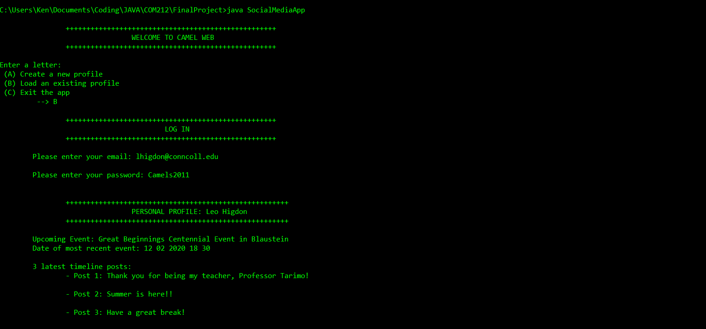

# Console Social Media App
An console-based social media app (Final Project of COM212)

## Requirements
Please ensure that you have installed the below items in order to run the application
- Java Developement Kit 8 or later (Java Runtime Environement included). You can download from Oracle's website: https://www.oracle.com/java/technologies/javase/javase-jdk8-downloads.html
- The .txt file. This file serves as a Database for this program.

## Installation

Clone this repository to your computer:
```
$ git clone https://github.com/meobilivang/ConsoleSocialMediaApp
```
## Compile and run

### 1. Compiling the program: SocialMediaApp.java
You just need to compile the main class of this program. Feel free to add other test cases to this class  
```
$ javac SocialMediaApp.java
```

### 2. Run the compiled class:
Run this command to start this Java application:
```
$ java SocialMediaApp
```

               

## Enjoy my first big project with Java !


